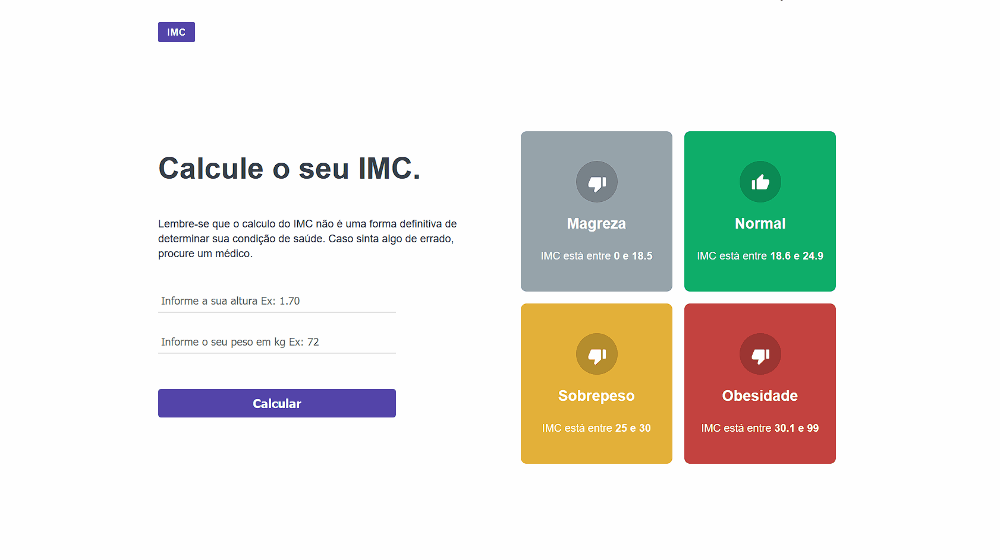
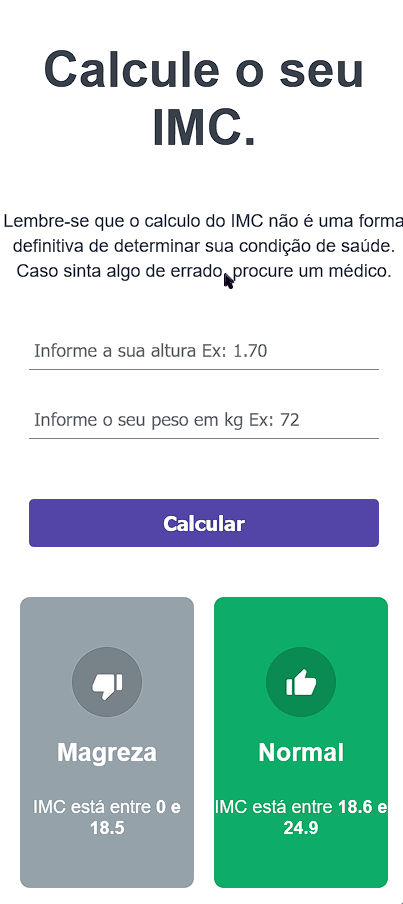

<h1 align="center">
    Calculadora de IMC
</h1>

<h4 align="center"> 
	Concluído 🚀
</h4>

## 🎨 Layout

O layout do projeto:

### Web

  

### Mobile

  

---
 

## 💻 Sobre o projeto

Calculadora de imc feita com ReactJS.

---
 

## 🛠 Tecnologias

As seguintes ferramentas foram usadas na construção do projeto:

-   **[ReactJS](https://github.com/topics/javascript)**
-   **[Css3](https://github.com/topics/css)**

---
 

## 🚀 Como testar o projeto

-   Você pode testar o projeto aqui: **[Live Code](https://imccalculator.vercel.app/)**
---
